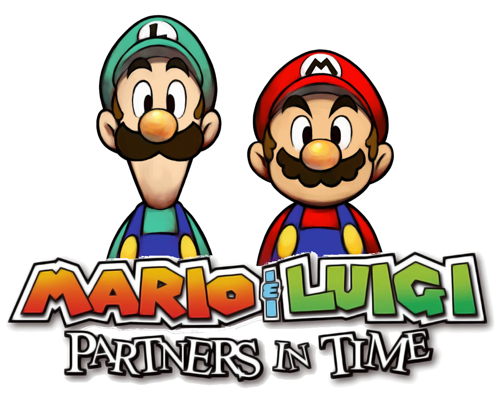
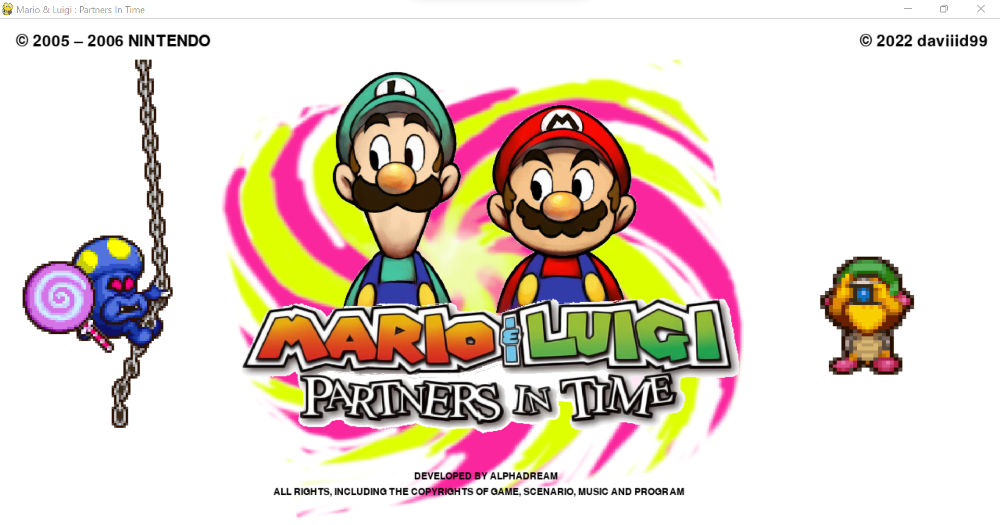

  <br/>
W.I.P Mario and Luigi Partners In Time made with Python

 
<br/>

# Screens


<br/>


# Installation

```GNU/Linux ```
```
git clone https://github.com/daviiid99/Mario_And_Luigi_Partners_In_Time_RPG.git Mario_And_Luigi_Partners_In_Time_RPG
cd Mario_And_Luigi_Partners_In_Time_RPG
python3 main.py
```
<br/>

``` Microsoft Windows```
```
git clone https://github.com/daviiid99/Mario_And_Luigi_Partners_In_Time_RPG.git Mario_And_Luigi_Partners_In_Time_RPG
cd Mario_And_Luigi_Partners_In_Time_RPG
python main.py
```
